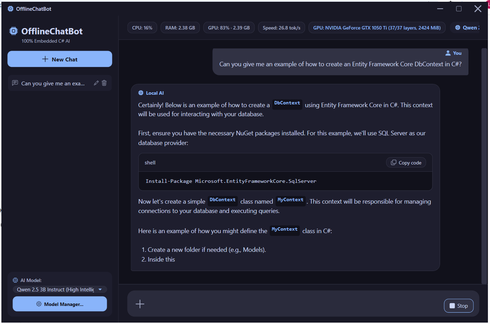
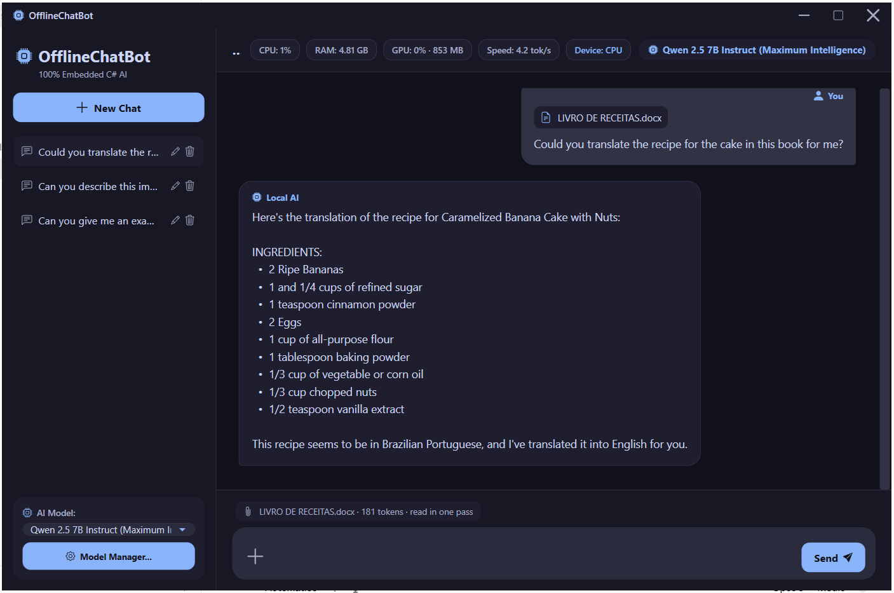
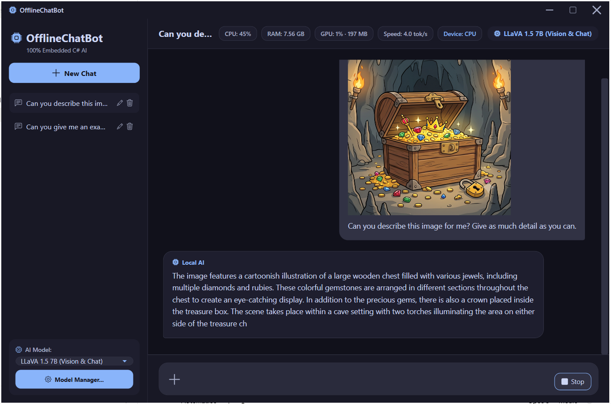

# 🤖 OfflineChatBot

[](https://github.com/LeoLopesDev82/OfflineChatBot/actions/workflows/ci.yml)

A desktop chat application that runs language models on the machine itself. No cloud API, no account, nothing leaves the computer. It answers questions about the PDF, Word and Excel files you attach, describes images, and reports what the hardware is doing while it works.

Two problems shaped most of the engineering. A document is usually larger than the model's context window, so it is read in parts and every part is asked the question, instead of a search picking the fragments it guesses are relevant. And a small model cannot be trusted to add up a column, so every figure taken from a spreadsheet is computed in C# and handed back to the model only to be worded.

Built on .NET 9 with WPF and MVVM, running local inference through [LLamaSharp](https://github.com/SciSharp/LLamaSharp) over llama.cpp. Qwen 2.5 answers, LLaVA 1.5 reads images, and both are downloaded from inside the application.

## 📸 Screenshots

**Chat with live hardware metrics.** A coding question answered by Qwen 2.5 3B with all 37 layers offloaded to the GPU. The header reports CPU, RAM, video memory, generation speed and the active device while the answer streams in, and code blocks are rendered with syntax highlighting and a copy button.



**Question answering over a document.** A Word file attached to the conversation and answered from its contents. The strip above the composer stays visible for as long as the conversation holds the document, reporting its size in tokens and whether it fits in a single pass or has to be read in parts on every question.



**Vision.** LLaVA 1.5 7B describing an image attached to the chat. The model runs on the CPU here because 4.4 GB of weights do not fit the 4 GB card, and the app reports that instead of failing.



## 🛠️ Technical Highlights

* **Local Inference Engine:** Executes `.gguf` quantized models locally.
* **GPU Acceleration:** Offloads model layers to the GPU through the Vulkan backend, falling back to the CPU automatically when no compatible device is available or when the model does not fit in video memory.
* **Document Question Answering:** Reads PDF, Word and text files and puts the whole text in front of the model, so an answer is never limited to the fragments a search happened to pick. The conversation context is kept loaded between messages, so the document is read once and every question after the first is answered immediately.
* **Spreadsheet Question Answering:** Reads `.xlsx` files, finds the tables inside a sheet rather than assuming one starts at A1, and computes every figure in C# so no total ever comes out of the model.
* **Context Budgeting:** Counts real tokens with the model tokenizer and trims the oldest turns to fit the context window, reserving room for the answer instead of guessing with a fixed message count.
* **Vision Support:** Runs multimodal models (LLaVA 1.5 7B) to interpret images attached to the chat, handling the multimodal projection weights and per-turn media state.
* **Integrated Model Manager:** Includes an asynchronous download manager to fetch HuggingFace models directly from the UI, with proper stream handling and progress reporting.
* **Clean Architecture:** Built heavily upon SOLID principles and Single Responsibility, with services behind interfaces and a dependency injection composition root.
* **MVVM Pattern:** Strict separation of UI logic and business rules using `CommunityToolkit.Mvvm`.
* **Resource Management:** Safe handling of unmanaged C++ memory handles (llama.cpp) during model loading, unloading, and deletion.
* **WPF UI:** Features real-time Markdown rendering, syntax highlighting for code blocks, and live CPU/RAM usage indicators.

## 🧱 Project Structure

The solution is split so that everything except the presentation layer is free of any UI framework dependency:

| Project | Target | Responsibility |
| --- | --- | --- |
| `OfflineChatBot.Core` | `net9.0` | Models, service abstractions, local inference, prompt building, model catalog and downloads. No WPF reference. |
| `OfflineChatBot` | `net9.0-windows` | WPF views, view models, behaviors, converters and the platform services that implement the Core abstractions. Composition root lives in `App.xaml.cs`. |
| `OfflineChatBot.Tests` | `net9.0-windows` | xUnit suite exercising the Core services and the view models. |

189 tests cover the spreadsheet block detection and query validation, the document splitting, the prompt assembly and context budgeting, the download and retry state machine, and the view model orchestration. They use hand written test doubles rather than a mocking library, and run on every push through GitHub Actions.

```bash
dotnet test
```

## 🔧 Configuration and Diagnostics

Inference settings live in `appsettings.json`, so the model behaviour can be tuned without recompiling:

```json
{
  "Logging": { "MinimumLevel": "Information" },
  "Generation": {
    "ContextSize": 8192,
    "MaxTokens": 2048,
    "MaxHistoryTokens": 2048,
    "UseGpu": true,
    "GpuLayerCount": 99,
    "Temperature": 0.7,
    "RepeatPenalty": 1.18,
    "TopK": 40,
    "TopP": 0.95
  }
}
```

`UseGpu` can also be toggled at runtime from the Model Manager, which reloads the active model and reports the device in the status bar. Vulkan was chosen over CUDA because it only requires an up to date graphics driver, works on NVIDIA, AMD and Intel hardware, and keeps the restore under 100 MB instead of the 1.4 GB the CUDA backend pulls in.

Measured on a GeForce GTX 1050 Ti (4 GB) with Qwen 2.5 3B Q4_K_M, all 37 layers offloaded:

| | CPU | GPU (Vulkan) |
| --- | --- | --- |
| Model load | 8.0s | 3.5s |
| Time to first token | 2.0s | 0.3s |
| Generation | 8.1 tok/s | 29.6 tok/s |

The status bar reports live GPU utilization and dedicated video memory, read from the same Windows performance counters that Task Manager uses, alongside the device actually running the model, how many layers were offloaded and the measured generation speed. Both numbers are needed to read the situation correctly: the application always draws its own interface on the GPU, so a few percent of activity there says nothing about where inference is running.

**Model size decides whether the GPU is used at all.** The weights must fit in video memory, so on a 4 GB card the 3B model loads entirely on the GPU while the 7B vision model does not fit and falls back to the CPU. That fallback is expected rather than a failure, and the status bar shows `Device: CPU` when it happens. Partial offloading is possible by lowering `GpuLayerCount`, but it was measured at 16 of 33 layers and produced only 5.3 tok/s against 4.8 tok/s on the CPU, so it is rarely worth it. Be aware that intermediate values can exhaust video memory during allocation and terminate the process, since that failure happens inside the native library and cannot be caught; leaving the setting at 99 keeps the safe path, where a load failure is handled and falls back to the CPU.

Logging goes through `Microsoft.Extensions.Logging` with Serilog behind it, so the Core project depends only on the abstraction. Daily rolling files are written to `%AppData%/OfflineChatBot/Logs/`, keeping the last seven days, and unhandled UI exceptions are recorded before the application goes down.

## 📄 Talking to a Document

Attaching a file extracts its text (PdfPig for PDF, OpenXml for Word) and sends all of it to the model. Nothing is split, ranked or sampled: the model sees the document the user sees. That is what makes questions about the whole document work, such as which chapters mention a deadline, which no amount of passage retrieval can answer because the answer does not live in any single passage.

When the document fits, reading it is the expensive step and it is paid once. Because the conversation context stays loaded, the document is processed on the first question and every question after it starts from the work already done. Measured with a fifteen page document, the first answer took 38.5s and the next ones 0.4s.

A file larger than the context window is not turned away and is never cut down to what fits. It is read in parts: the question is put to every part in turn, each part answers with what it holds or with nothing, and the collected notes become the context for the final answer. Nothing is skipped, so a name that appears once in the middle of a long document is still found, which is exactly what retrieval could not do. The cost is one pass per part on every question, so the application says how many parts a file needs and asks before accepting it, then reports progress and a running estimate while it works.

How expensive that is depends entirely on the hardware, and the difference is not subtle. On the GeForce GTX 1050 Ti this was built on, a seventy six thousand token novel is read in eleven parts and takes about fourteen minutes for every question asked. The same work on a card able to hold a long context model needs no parts at all: the novel fits in a single pass, the conversation context keeps it loaded, and every question after the first is answered immediately. The technique is the fallback for when the document does not fit, not the path a capable machine takes.

The previous version of this feature searched the document instead of reading it, embedding passages and retrieving the closest ones to each question. It was measured, it worked as designed, and it was still replaced: retrieving four passages of a book puts under one percent of it in front of the model, so questions that need the whole picture came back wrong no matter which chat model answered them. Identical bad answers across different models is what pointed at the context rather than the model.

Scanned PDFs have no text layer and are rejected with an explanation, since character recognition is not supported. The legacy binary `.doc` format is out of scope.

## 📊 Talking to a Spreadsheet

A spreadsheet is not prose, and reading it as prose fails in two ways: a language model cannot be trusted to add up a column, and a real sheet is rarely one clean table starting at A1. Both problems are handled in code before the model sees anything.

The sheet is read cell by cell, including merged ranges, and the tables inside it are found by looking for islands of filled cells. A merged banner across the width is a title, a merged strip above a denser row is a group header, a blank row separates one table from the next, and a short trailing row offset to the right is a totals row that must be kept out of the data. These rules were written against real files: the two spreadsheets used to develop this both had a title above the data, and one had a two level header where the real column names sit on the third row. Duplicate column names are disambiguated with their column letter, so a sheet with two columns called the same thing does not contradict itself.

Each table is then profiled in C#: the type of every column, and the sum, average and range of the numeric ones, counting only the values that really are numbers. A column holding both amounts and the word "presente" reports how many of its cells were numeric, so a total is never quietly computed over a subset that looks like the whole.

The model receives that profile and the sheet as a tab separated table. When a question can be answered by a query, the model writes one as a small JSON object, C# runs it over the file, and the result is handed back for the model to phrase. Column names must match exactly or the query is refused, a condition naming a value no row holds is refused rather than answered with zero, and an ambiguous column name comes back asking which one was meant. Nothing is guessed: the answer is either computed from the file or the application says it cannot work it out.

Reading a table is where a small model struggles most, and it struggles in a particular way: it takes a value from one row and reports it under another. Both a 3B and a 7B model did this on the same file. That is the reason every figure is computed in code rather than read out of the table by the model, and the reason a query that cannot be validated is refused instead of answered.

## 🚀 Getting Started

### Prerequisites
* Windows OS
* .NET 9.0 SDK or later

### Installation
1. Clone the repository:
   ```bash
   git clone https://github.com/LeoLopesDev82/OfflineChatBot.git
   ```
2. Build and run it, either from Visual Studio by opening `OfflineChatBot.sln`, or from the command line:
   ```bash
   dotnet run --project OfflineChatBot -c Release
   ```
3. On the first launch, open the **Model Manager** to download a Qwen 2.5 model. The larger the model, the better it reads tables and long documents.
4. To analyze images, download **LLaVA 1.5 7B (Vision & Chat)** in the Model Manager, select it as the active model, and attach an image through the composer.
5. To ask questions about a document, attach a PDF, Word or text file through the composer. No extra model is needed, and the file is read in full.
6. To ask questions about a spreadsheet, attach an `.xlsx` file. Its tables are found and profiled in code, and any figure you ask for is computed from the file rather than written by the model.

## 🗺️ Roadmap

The architecture was designed to be extended.

**Delivered**

- [x] **Vision Models:** Support for Vision-Language Models (VLMs), allowing users to attach images to the chat for context-aware interactions.
- [x] **Document Analysis:** Reading PDF, Word and text files in full, with the conversation context kept loaded so the document is processed once.
- [x] **Reading Long Documents in Parts:** Putting the question to every part of a file that does not fit the context window, so size costs time rather than accuracy.
- [x] **Spreadsheet Analysis:** Reading `.xlsx` files, with the structure of each sheet detected and every figure computed in code.
- [x] **Hardware Acceleration:** GPU offloading through the Vulkan backend, toggleable at runtime, with automatic fallback to the CPU.
- [x] **Prompt Format per Model:** Talking to each model in the template it was trained on, since a vision model and an instruct model do not share one.
- [x] **Document Attachment Split Out:** Moving the attachment state, the parted reading and the spreadsheet query into their own view model, so the chat one is left with conversations, sending and generation.
- [x] **Inference Service Split:** Separating the loaded model, which owns the weights, the context and the executor, from the service that turns a conversation into a prompt and a stream of text.

**Next**

- [ ] **Looking Things Up:** Consulting the internet when a question needs current information, with the model deciding in the background whether external context is needed.
- [ ] **A Stronger Vision Model:** Moving to LLaVA 1.6 or Qwen2-VL once LLamaSharp supports them, since 1.5 is the weakest link in the image path.

## ⚙️ Technology Stack
* **Language:** C# 13 / .NET 9.0
* **UI Framework:** WPF (Windows Presentation Foundation)
* **Design Pattern:** MVVM
* **AI Engine:** LLamaSharp (llama.cpp wrapper)

## 🤝 About This Repository

This is a personal project, built to explore what local inference can and cannot do on ordinary hardware, and kept as a portfolio piece rather than a product. Questions and observations are welcome through the issues page.

## 📝 License
This project is licensed under the MIT License - see the LICENSE file for details.
